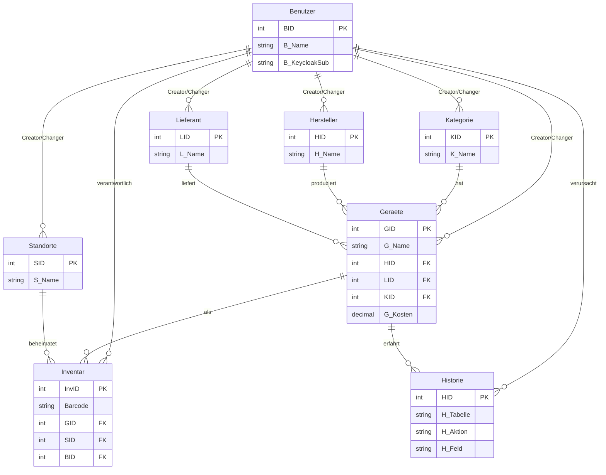
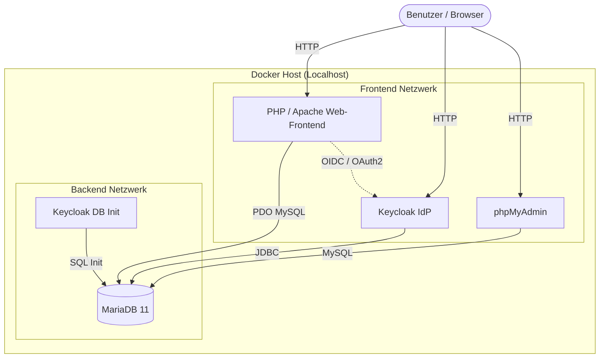

# 📦 RST-Inventar

> Webbasiertes Inventarverwaltungssystem der RST-Veolia GmbH & Co. KG, Herrenberg  
> IHK-Abschlussprojekt · Fachinformatiker Systemintegration · 2026

---

## 🗂️ Projektphasen

### Phase 1 · Analyse & Anforderungsaufnahme `3,5 Std.`

> *Was brauchen wir – und warum reicht Excel nicht mehr?*

- 🔍 IST-Analyse der bestehenden Excel-Inventarverwaltung durchgeführt
- ⚠️ 6 Schwachstellen identifiziert (SW-01 bis SW-06)
- 📋 Anforderungsdefinition gemeinsam mit dem Ausbilder erstellt
- 🗃️ Datenbankfelder, Datentypen und Tabellenstruktur definiert

---

### Phase 2 · Datenbankdesign `4,0 Std.`

> *Planung der relationalen Datenbankstruktur RST-Inventar*

- 🏗️ 6 Tabellen entworfen: `Geraete` · `Kategorie` · `Standorte` · `Benutzer` · `Inventar` · `Historie`
- 🔗 Fremdschlüsselbeziehungen und Kardinalitäten (alle 1:n) festgelegt
- 📊 ER-Diagramm erstellt mit [dbdiagram.io](https://dbdiagram.io)
- 📝 SQL-Script vorbereitet (Tabellen, Indizes, Trigger, Stored Procedure)

---

### Phase 3 · Systemumgebung einrichten `3,0 Std.`

> *Einrichtung und Konfiguration der Systemumgebung unter XAMPP*

- 🖥️ XAMPP installiert und konfiguriert (Apache + MySQL + PHP)
- 🌐 Apache HTTP Server für internes Netzwerk eingerichtet
- 🗄️ MySQL-Datenbank `RSTInventar` über phpMyAdmin importiert
- 📚 Picqer Barcode-Bibliothek eingebunden (`git clone`)

```bash
# Picqer Barcode-Bibliothek installieren
cd app/vendor
git clone https://github.com/picqer/php-barcode-generator.git picqer
```

---

### Phase 4 · Datenbankimplementierung `7,5 Std.`

> *Einrichtung der Datenbankstruktur über phpMyAdmin*

- ✅ Alle 6 Tabellen mit Fremdschlüsseln und Constraints eingerichtet
- ⚡ 7 Indizes für optimale Abfrageperformance konfiguriert
- 🔄 4 Trigger für automatische Versionierung eingerichtet:
  - `trg_geraete_insert` · `trg_geraete_update` · `trg_geraete_delete` · `trg_inventar_update`
- ⚙️ Stored Procedure `sp_GeraetAnlegen` eingerichtet (Transaktion)
- 🧪 23 Testdatensätze eingespielt und geprüft

```sql
-- Stored Procedure aufrufen
CALL sp_GeraetAnlegen('Dell UltraSharp 27"', 'Dell', 'Bechtle',
  '2022-03-15', 549.00, '2025-03-15', 1, 1, 1, 'RST-0001');
```

---

### Phase 5 · PHP-Webanwendung `12,5 Std.`

> *Entwicklung der webbasierten Inventarverwaltungsoberfläche*

- 🔐 Login mit Session-Verwaltung und bcrypt Passwort-Hashing
- 📊 Dashboard mit Statistiken und Garantie-Warnungen
- ➕ Inventarartikel anlegen über Stored Procedure
- 🏷️ Barcode-Generierung und -Druck via Picqer (Code 128)
- 🔎 Inventarliste mit Suche, Kategorie- und Standortfilter

---

## 🚀 Setup

**Voraussetzungen:** XAMPP (Apache + MySQL + PHP 8.x)

```bash
# 1. Projekt in XAMPP ablegen
C:\xampp\htdocs\rst-inventar\

# 2. Picqer Barcode-Bibliothek installieren
cd app/vendor
git clone https://github.com/picqer/php-barcode-generator.git picqer

# 3. Datenbank importieren
# phpMyAdmin → Importieren → db/RSTInventar.sql

# 4. Anwendung aufrufen
http://localhost/rst-inventar/app/
```

**Standard-Login:** `admin` / `password`

---

## 🗃️ Projektstruktur

```
rst-inventar/
├── app/
│   ├── index.php               ← Login
│   ├── config/
│   │   ├── db.php              ← Datenbankverbindung (nicht im Repo!)
│   │   └── app.php             ← App-Konstanten
│   ├── includes/
│   │   ├── auth.php            ← Session & Login
│   │   └── layout.php          ← HTML Header/Footer
│   ├── pages/
│   │   ├── dashboard.php
│   │   ├── inventar-erstellen.php
│   │   ├── inventar-liste.php
│   │   ├── barcodes.php
│   │   └── logout.php
│   ├── assets/
│   │   ├── css/app.css
│   │   └── js/app.js
│   └── vendor/
│       └── picqer/             ← Barcode-Bibliothek (git clone)
└── db/
    └── RSTInventar.sql         ← Datenbankstruktur + Testdaten
```

---

## 🛠️ Technologie-Stack

| Komponente | Technologie |
|---|---|
| Webserver | Apache (via Docker) |
| Datenbank | MariaDB 11 (via Docker) |
| DB-Administration | phpMyAdmin |
| Identity Provider | Keycloak 24.0 |
| Backend | PHP 8.2 |
| Barcode-Generierung | [picqer/php-barcode-generator](https://github.com/picqer/php-barcode-generator) |
| Versionsverwaltung | Git / GitHub |

---

## 🏗️ Systemarchitektur

### Datenbank-Modell (ER-Diagramm)



### Netzwerk-Übersicht (Docker-Umgebung)



---

## ⏱️ Gesamtzeit

| Phase | Zeit |
|---|---|
| Analyse & Anforderungsaufnahme | 3,5 Std. |
| Datenbankdesign | 4,0 Std. |
| Systemumgebung einrichten | 3,0 Std. |
| Datenbankimplementierung | 7,5 Std. |
| PHP-Webanwendung | 12,5 Std. |
| Test, Dokumentation & Abnahme | 9,5 Std. |
| **Gesamt** | **40,0 Std.** |

---

*RST-Veolia GmbH & Co. KG · Herrenberg · IHK-Abschlussprojekt 2026*
